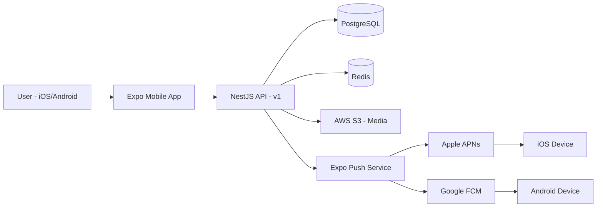
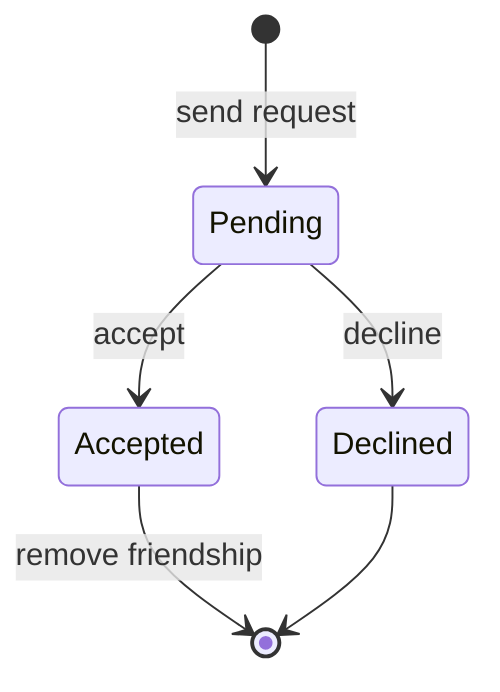
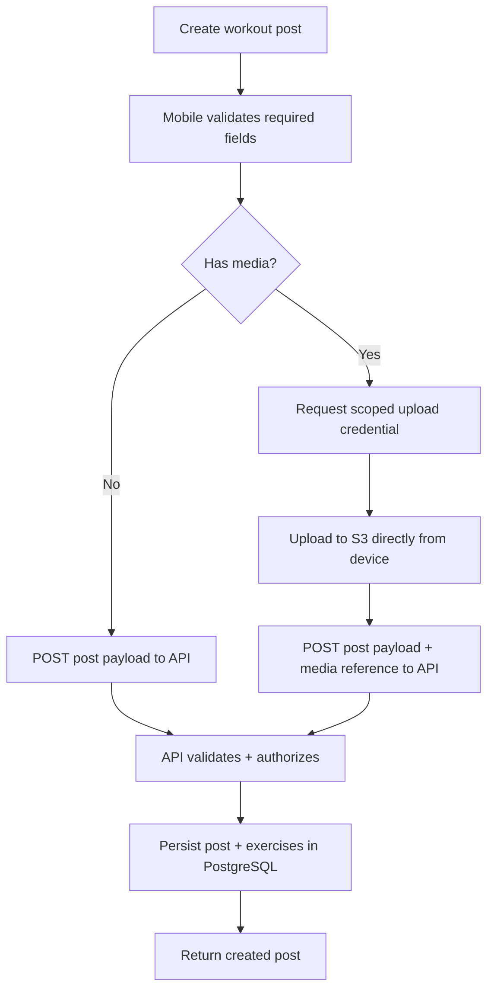
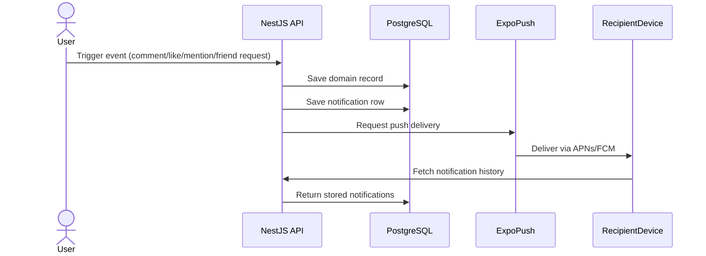
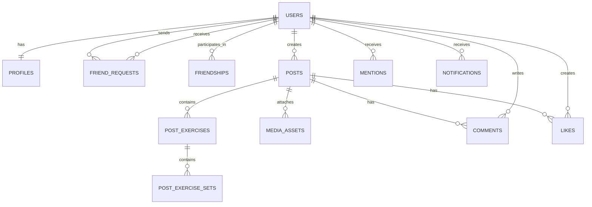
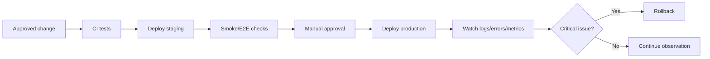

# Gym App: System Architecture

## Document Control

- Document ID: `ARCH-001`
- Version: `1.0`
- Status: `Draft`
- Audience: Developer + DevOps
- Owner: Nicholas Pinto

> **How to read this doc:** This is the authoritative design record for engineering decisions. It assumes you know general web/mobile concepts, but every non-obvious or advanced idea gets a short **Note** callout so a student-level reader isn't lost. If this doc and the beginner doc ever disagree, this doc wins — the beginner doc should be updated to match.

---

## 1. Scope Reference

This document implements the MVP. This doc answers: *given that scope, how is the system built?*

MVP decision updates reflected here:
- Shares are deferred (not MVP).
- Per-account post-notification preference is included in MVP.

Out of scope (deferred, do not design for): AI form-checking, leaderboards, anti-cheat, web client, admin UI, microservices, post shares.

---

## 2. System Overview

### 2.1 Components



| Component | Responsibility | Notes |
|---|---|---|
| Expo Mobile App | UI, input collection, token storage, calls API | Untrusted client — never trusted for authorization |
| NestJS API | Auth, validation, business rules, authorization, orchestration | Single deployable, modular monolith (see §7) |
| PostgreSQL | System of record for all domain data | Managed instance (RDS or equivalent) |
| Redis | Rate-limit counters, short-lived cache | Not a data store of record |
| S3 | Media file bytes | DB stores only metadata/keys |
| Expo Push Service | MVP push delivery orchestration | Routes to APNs/FCM; not the source of truth (DB is) |

> **Note — why a "modular monolith" instead of microservices:** One deployable service is far cheaper to build, test, and operate for a small beta. Microservices add network calls, deployment coordination, and operational overhead that isn't justified until team size or scale demands it. Module boundaries inside the monolith (§7) preserve the *option* to split later without a full rewrite.

### 2.2 Trust Boundaries

| Boundary | Trust rule |
|---|---|
| Mobile → API | Mobile is untrusted. API validates every input and re-checks authorization server-side regardless of what the client sends. |
| API → PostgreSQL | Only the API writes business data. Mobile never connects directly to the DB. |
| API → S3 | API issues scoped, short-lived upload/read credentials per request; storage is never left open. |
| API → Push | A push is only sent after the corresponding notification row exists in PostgreSQL. |

> **Note — why this matters:** Most real-world security bugs come from trusting client-supplied values (e.g., trusting a `userId` field the client sends instead of the one derived from the auth token). Every endpoint in this system must derive identity from the verified access token, never from client-supplied identifiers.

---

## 3. Authentication & Sessions

- Methods: email/password and Google OAuth sign-in.
- Backend-owned auth (no Firebase Auth / third-party identity provider); rationale: ownership + reduced dependency risk.
- Token model: short-lived **access token** (JWT) + longer-lived **refresh token**.
  - Access token: sent on every protected request, verified per-request, never persisted server-side.
  - Refresh token: persisted (hashed) server-side so it can be revoked; used only to mint a new access token.
- Password storage: hashed with a modern adaptive hash (bcrypt or argon2id) — never reversible, never logged.
- Failure handling: invalid/expired refresh token → force sign-out client-side.

> **Note — access vs refresh token:** Access token = a short window (minutes). Refresh token = a token you can give for a new access token without re-entering your password. Short-lived access tokens limit the damage if one leaks; a revocable refresh token lets the program kill a stolen session without invalidating every token type globally.

**Rate-limited:** login, register, refresh, password-reset request (see §9).

---

## 4. Social Graph & Privacy

- Private-by-default: no content is visible without an accepted friendship.
- Friendship = mutual, symmetric relationship reached via a request lifecycle (not one-way follow).



- Search: case-insensitive prefix match on username/display name; accepted friends ranked first, mutuals next; result count capped.
- Authorization rule enforced **server-side on every read**: profile fields and posts are filtered based on the caller's relationship to the resource owner (owner / accepted friend / pending / unrelated), never based on what the mobile UI chooses to display.

---

## 5. Workout Posts, Media & Feed

### 5.1 Post model
A post requires a caption and at least one workout entry (at least one weight-training set data point or cardio activity/time entry); media is optional. See §8 (data model) for entity shape.

### 5.2 Media upload flow



Media limits: images ≤ 10 MB; videos ≤ 30s / 50 MB; device-side compression where practical. Orphaned uploads (upload succeeded, post creation failed) are cleaned up by a scheduled sweep job matching S3 keys with no corresponding DB reference.

### 5.3 Feed
- Eligibility: accepted-friend posts only.
- Order: reverse chronological only (no engagement ranking in MVP).
- Pagination: cursor-based (opaque cursor encodes last-seen post id/timestamp), not offset/page-number.

> **Note — why cursor pagination:** Offset pagination ("give me page 2") breaks when new rows are inserted between page loads — items shift and users see duplicates or miss posts. A cursor ("continue after post X") is stable regardless of concurrent inserts during application use.

### 5.4 Engagement
- Likes: unique constraint on `(userId, postId)` — retries are idempotent, never duplicate.
- Comments: author + post association stored; comment authors can delete their own comments, and post authors can remove any comment on their own post.
- Mentions: `@username` resolves to a mention record **only if the mentioning user and the mentioned user are friends**; otherwise the token renders as plain text (`@plain_text`), never a link. Mention notifications never bypass friendship-based visibility.

---

## 6. Notifications

Database is the source of truth; push is a best-effort delivery mechanism layered on top.



- Retention: notification rows retained 7 days.
- Push failures are logged but never block the underlying domain action (comment/like/friend-request already succeeded before push is attempted).
- Events: friend request received/accepted, likes, comments, mentions, and new-post alerts for followed friend accounts where the recipient enabled post notifications for that account.

### 6.1 Per-account post notifications (MVP)

- From a user's profile options menu, a friend can enable or disable "Turn on post notifications for {account_name}".
- This preference is stored per actor-target pair (who enabled notifications, and for which friend account).
- Push is sent only when:
  - the actor has enabled notifications for that target account; and
  - both users are still in an accepted friendship state.
- The profile options menu can include other account actions (for example, remove friend), but those are separate actions from notification preference toggling.

---

## 7. Backend Module Architecture (NestJS)

Modular monolith — one deployable, organized by feature module. Each module: `Controller` (HTTP in/out) → `Service` (business rules) → `Repository`/data layer (DB access) → `DTO` (validation of input/output shape).

Modules: `Auth`, `Users/Profiles`, `Friendships`, `Search`, `Posts/Workouts`, `Media`, `Engagement` (likes/comments/mentions), `Notifications` (including per-account notification preferences), `DataRights` (export/delete), `Shared` (config, DB, logging, error handling).

Rules:
- Controllers stay thin — no business logic.
- Cross-module imports are reviewed to avoid circular dependencies; modules communicate through service interfaces, not shared mutable state.
- Validation happens at the DTO boundary before a request reaches a service.

> **Note — DTO:** a "Data Transfer Object" is just a class describing exactly what shape of data is allowed in/out of an endpoint, validated automatically (e.g., via `class-validator`) before your business logic ever runs. It's the enforcement point for "never trust client input."

---

## 8. Data Architecture

### 8.1 Entity relationship diagram



A draft Prisma schema implementing this model is in [Appendix A](#appendix-a-draft-prisma-schema). Treat it as a starting point for the first migration, not a final contract — it will be refined during the Foundation slice.

### 8.2 Invariants enforced at the DB layer (not just app code)

- `username` unique.
- Unique `(userId, postId)` on likes.
- No duplicate active friend request/friendship between the same two users.
- Reps/load/duration are non-negative (check constraints).
- A post row cannot exist without its required caption; at least one exercise entry is enforced at the service layer inside a transaction (see note below).

> **Note — why some rules are DB constraints and others are transactional service logic:** Simple invariants (uniqueness, non-negative numbers) map directly to DB constraints and are cheap to enforce there. "At least one exercise entry" spans two tables (post + post_exercises), so it's enforced by wrapping post + first exercise creation in a single DB transaction in the service layer — the post row is never committed without its first exercise.

### 8.3 Account deletion

Hard delete: on confirmed account deletion, the user's owned rows (profile, posts, exercises, comments, likes, mentions-authored, notifications, media ownership) are removed.

Deletion order and cascade behavior must be explicitly defined (not left to implicit DB cascade) so we can guarantee no orphaned S3 objects or dangling foreign keys. This is finalized as part of the Data Rights implementation task, not assumed here.

---

## 9. API Architecture

- Single version namespace: `/v1`, additive changes only (no breaking changes without a `/v2`).
- Contract-first: every endpoint is specified (purpose, auth requirement, request/response shape, errors, visibility rule) before implementation. A skeleton OpenAPI spec is in [Appendix B](#appendix-b-openapi-skeleton).
- Unified error envelope:

```json
{
  "code": "FRIEND_REQUEST_ALREADY_EXISTS",
  "message": "A pending friend request already exists.",
  "details": [],
  "requestId": "trace-id"
}
```

- Pagination: cursor-based for feed; capped limit for search; no page-number pagination anywhere.
- Idempotency: retryable writes (likes, friend requests) must not create duplicates on retry.

---

## 10. Security & Abuse Prevention

- Authorization is re-checked server-side on every protected read/write — never inferred from the client.
- Rate limits (by user + IP + endpoint, tuned from real logs after week 1) apply to: login/register, friend requests, comments, likes, uploads, data-deletion requests.
- Secrets: never committed to source control; loaded from environment/secret manager per environment.
- Media validation: type/size/duration enforced server-side, not just client-side.
- No PII/secrets/tokens in logs.

---

## 11. Observability

Minimum viable signals:
- Structured request logs: request ID, route, status, duration, safe user identifier.
- Centralized error tracking.
- Health check endpoint.
- Technical metrics: error rate, latency, notification delivery failures, upload failures.
- Product signals: signups, first posts, friend-request acceptance rate, feed visits, retention.

---

## 12. Environments, Deployment & Reliability

- Environments: `dev`, `staging`, `prod`.
- Deploy target: AWS managed app hosting platform first (e.g., App Runner/Elastic Beanstalk-class service), with containerized service as the defined upgrade path if more control is needed later.
- Release flow: change → local/CI tests → deploy staging → smoke/E2E checks → manual approval → deploy prod → monitor → rollback if critical.



- Backups: daily automated PostgreSQL backups, 14-day retention.
- Recovery targets: RPO 24h, RTO 4h.

### Brief runbook bullets (expand only when actually needed — this is far in the future)
- **Push outage:** confirm notification rows still write correctly (DB is source of truth); push delivery can be retried/backfilled once the provider recovers.
- **Deploy failure:** roll back to last known-good staging-verified build; do not patch forward under pressure.
- **Data restore:** restore from most recent backup in staging first, verify, then restore prod within the RTO window.
- **Abuse spike:** tighten rate limits on the affected endpoint first; investigate after the spike is contained.

---

## 13. Testing Strategy

Three levels, all required: unit (isolated rules), integration (real DB/test env, e.g., friendship acceptance affecting feed visibility), critical-flow E2E.

Critical flows requiring E2E coverage: register/login/refresh → create profile → search + send/accept friend request → create workout post → view authorized feed → like/comment/mention → receive/view notification → export/delete account.

---

## 14. Performance & Scale Preparation (light touch for MVP)

- Index feed query path on `(friendship-visibility, createdAt)`-equivalent access pattern.
- Index search on username/display name for prefix matching.
- Redis reserved for rate-limit counters now; caching feed/search results is a post-MVP optimization, not required at beta scale (20–50 users).
- Known inflection point: if feed/search latency degrades, first lever is targeted indexes/query tuning before introducing new infrastructure.

---

## 15. Deferred Features & Extension Points

Not designed for in v1, but the module boundaries (§7) and data model (§8) are chosen so they can be added later without a rewrite:
- AI form-checking (would likely be a new module consuming post/exercise data).
- Leaderboards (would consume existing workout data via a new read-optimized query/service, not a schema rewrite).
- Advanced analytics (would consume the same event/domain data via export, not inline in the request path).
- Post shares.
- Meal tracking / calorie intake tracking
- Group events or workouts created by an organizer, able to share to an array of selected friends on the app

---

## 16. Acceptance Checklist

- [x] Every locked decision from the beginner doc/blueprint is reflected accurately here.
- [ ] No contradictions with `STEP_01_LAUNCH_TARGET.md` v1.1.
- [x] All diagrams render correctly (verified via Mermaid preview).
- [x] Security, testing, deployment, and reliability sections are present at implementation-ready depth.
- [ ] Founder has explicitly approved this doc for commit.

---

## Appendix A: Draft Prisma Schema

> Starting point only — will be refined during the Foundation implementation slice, not a frozen contract.
>
> `@@check(...)` lines are illustrative documentation of intended DB-level constraints. Implement exact check constraints via the migration layer supported by the chosen Prisma/database workflow.

```prisma
model User {
  id            String   @id @default(uuid())
  email         String   @unique
  passwordHash  String?
  googleId      String?  @unique
  createdAt     DateTime @default(now())

  profile           Profile?
  sentRequests      FriendRequest[] @relation("Sender")
  receivedRequests  FriendRequest[] @relation("Receiver")
  posts             Post[]
  comments          Comment[]
  likes             Like[]
  mentionsReceived  Mention[]
  notifications     Notification[]
}

model Profile {
  id          String  @id @default(uuid())
  userId      String  @unique
  user        User    @relation(fields: [userId], references: [id])
  username    String  @unique
  displayName String
  bio         String?
  avatarKey   String?
}

enum FriendRequestStatus {
  PENDING
  ACCEPTED
  DECLINED
}

model FriendRequest {
  id         String               @id @default(uuid())
  senderId   String
  receiverId String
  status     FriendRequestStatus  @default(PENDING)
  createdAt  DateTime             @default(now())

  sender     User @relation("Sender", fields: [senderId], references: [id])
  receiver   User @relation("Receiver", fields: [receiverId], references: [id])

  @@unique([senderId, receiverId])
}

model Friendship {
  id        String   @id @default(uuid())
  userAId   String
  userBId   String
  createdAt DateTime @default(now())

  @@unique([userAId, userBId])
}

model Post {
  id        String   @id @default(uuid())
  authorId  String
  caption   String
  createdAt DateTime @default(now())

  author    User            @relation(fields: [authorId], references: [id])
  exercises PostExercise[]
  media     MediaAsset[]
  comments  Comment[]
  likes     Like[]
  mentions  Mention[]
}

model PostExercise {
  id     String @id @default(uuid())
  postId String
  name   String
  kind   String // "strength" | "cardio"

  post Post                @relation(fields: [postId], references: [id], onDelete: Cascade)
  sets PostExerciseSet[]
}

model PostExerciseSet {
  id             String @id @default(uuid())
  postExerciseId String
  reps           Int?
  load           Float?
  units          String?
  durationSec    Int?

  postExercise PostExercise @relation(fields: [postExerciseId], references: [id], onDelete: Cascade)

  @@check(reps >= 0)
  @@check(load >= 0)
}

model MediaAsset {
  id        String @id @default(uuid())
  postId    String
  ownerId   String
  storageKey String
  kind      String // "image" | "video"

  post Post @relation(fields: [postId], references: [id], onDelete: Cascade)
}

model Comment {
  id        String   @id @default(uuid())
  postId    String
  authorId  String
  body      String
  createdAt DateTime @default(now())

  post   Post @relation(fields: [postId], references: [id], onDelete: Cascade)
  author User @relation(fields: [authorId], references: [id])
}

model Like {
  id       String @id @default(uuid())
  postId   String
  userId   String

  post Post @relation(fields: [postId], references: [id], onDelete: Cascade)
  user User @relation(fields: [userId], references: [id])

  @@unique([postId, userId])
}

model Mention {
  id              String @id @default(uuid())
  postId          String
  mentionedUserId String

  post          Post @relation(fields: [postId], references: [id], onDelete: Cascade)
  mentionedUser User @relation(fields: [mentionedUserId], references: [id])
}

model Notification {
  id        String   @id @default(uuid())
  userId    String
  type      String
  payload   Json
  createdAt DateTime @default(now())

  user User @relation(fields: [userId], references: [id])
}
```

---

## Appendix B: OpenAPI Skeleton

> Illustrative skeleton for the `/v1` namespace — full contracts are written per-endpoint before implementation (see §9).

```yaml
openapi: 3.0.3
info:
  title: Gym App API
  version: "1.0"
servers:
  - url: /v1
paths:
  /auth/register:
    post:
      summary: Register with email/password
      responses:
        "201": { description: Account created }
        "400": { description: Validation error }
  /auth/login:
    post:
      summary: Login with email/password
      responses:
        "200": { description: Access + refresh token issued }
        "401": { description: Invalid credentials }
  /auth/refresh:
    post:
      summary: Exchange refresh token for new access token
      responses:
        "200": { description: New access token issued }
        "401": { description: Invalid or expired refresh token }
  /profiles/me:
    get:
      summary: Get current user's profile
      security: [{ bearerAuth: [] }]
      responses:
        "200": { description: Profile returned }
  /friend-requests:
    post:
      summary: Send a friend request
      security: [{ bearerAuth: [] }]
      responses:
        "201": { description: Request created }
        "409": { description: Duplicate request or existing friendship }
  /friend-requests/{id}/accept:
    post:
      summary: Accept a pending friend request
      security: [{ bearerAuth: [] }]
      responses:
        "200": { description: Friendship created }
  /posts:
    post:
      summary: Create a workout post
      security: [{ bearerAuth: [] }]
      responses:
        "201": { description: Post created }
        "400": { description: Missing caption or exercise entry }
  /feed:
    get:
      summary: Get reverse-chronological friend feed
      security: [{ bearerAuth: [] }]
      parameters:
        - name: cursor
          in: query
          schema: { type: string }
      responses:
        "200": { description: Paginated feed page }
  /posts/{id}/likes:
    post:
      summary: Like a post (idempotent)
      security: [{ bearerAuth: [] }]
      responses:
        "200": { description: Like recorded or already existed }
  /posts/{id}/comments:
    post:
      summary: Comment on a post
      security: [{ bearerAuth: [] }]
      responses:
        "201": { description: Comment created }
  /notifications:
    get:
      summary: Get notification history
      security: [{ bearerAuth: [] }]
      responses:
        "200": { description: Notification list }
  /users/{id}/post-notification-preference:
    put:
      summary: Enable or disable post notifications for a specific friend account
      security: [{ bearerAuth: [] }]
      responses:
        "200": { description: Preference updated }
        "403": { description: Not allowed (not friends) }
  /data-rights/export:
    post:
      summary: Request self-service data export
      security: [{ bearerAuth: [] }]
      responses:
        "202": { description: Export requested }
  /data-rights/delete:
    post:
      summary: Request account deletion (hard delete)
      security: [{ bearerAuth: [] }]
      responses:
        "202": { description: Deletion requested }
components:
  securitySchemes:
    bearerAuth:
      type: http
      scheme: bearer
      bearerFormat: JWT
```

---

## Appendix C: Infrastructure Bullet List (MVP)

- Compute: AWS managed app hosting platform (e.g., App Runner or Elastic Beanstalk-class service) running the NestJS API container/build.
- Database: managed PostgreSQL (e.g., RDS), single instance per environment, automated daily backups (14-day retention).
- Cache/rate-limit: managed Redis (e.g., ElastiCache), single small instance.
- Object storage: S3 bucket per environment, private by default, scoped upload credentials per request.
- Push: Expo Push Service (MVP) → APNs/FCM.
- Secrets: environment-specific secret manager (e.g., AWS Secrets Manager or SSM Parameter Store) — never committed to source control.
- Environments: `dev` (local), `staging`, `prod` — isolated resources per environment, no shared databases.
